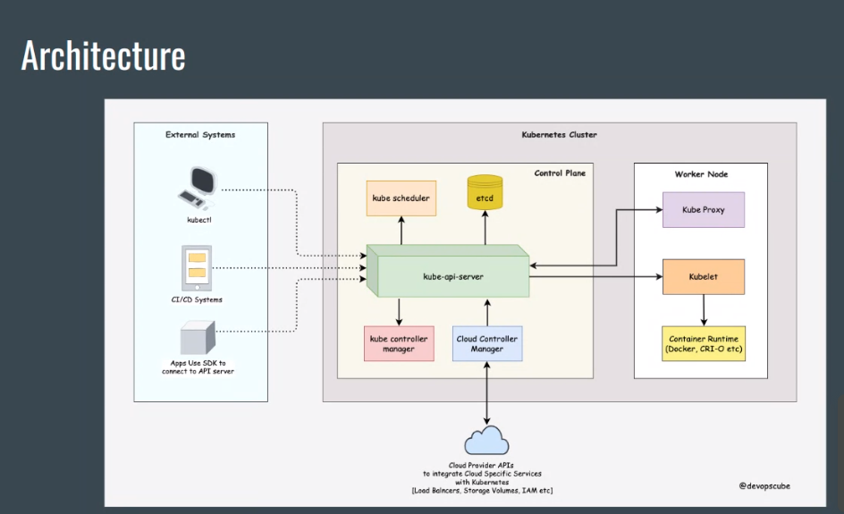

https://trainwithshubham.notion.site/Kubernetes-dd69fe52f8c8418ebdd97b3577c6daf4


#### Understand the Kubernetes architecture and document the same



- Control Plane (MASTER): That just gives the command to worker node to do the operations.
- Worker Node: Where the actual work is done. ( It gets the command from the Control Plane) <br>
<b> Container Runtime </b> It is responsible for managing the execution and lifecycle of containers within the Kubernetes environment <br> <i>Its like dependency</i>

#### <u>Worker Node:</u>
- kubelet: The kubelet is the primary "node agent" that runs on each node. (checks how the work is going on worker node)
- Kube Proxy: It is responsible for maintaining network connectivity between services and pods <br><b>(Assigns the IP for the container)</b>


#### <u>Control Plane:</u>
kube ctl: Toll required to run api server (It is the only one who can talk with `apiserver`)
- API Server: 
1. (group of server is called cluster)
2. CNI Network: Virtual Network (internal network worker can commnuicate with each other)
3. Node: Server where worker is there (actual work done)
4. POD: Single smallest unit of kubernetes


### Miniqube Installation

- To install the latest minikube stable release on x86-64 Linux using
```bash
curl -LO https://storage.googleapis.com/minikube/releases/latest/minikube-linux-amd64
sudo install minikube-linux-amd64 /usr/local/bin/minikube && rm minikube-linux-amd64
```
- Required `driver` to start miniqube (It will be docker or Virtual Machine)
- If you already have driver installed then give the command:
```bash
minikube start
```
- <b>If you dont have driver installed then it will give you the `ERROR`</b>


- <b>TO RESOLVE THIS ERROR INSTALL DRIVER:</b>
```bash
minikube start --driver=docker
```

#### TO RUN MINIKUBE YOU NEED DOCKER AND INSIDE THE MINIKUBE ALSO DOCKER ONLY WILL RUN
- INSTALL DOCKER
- Add docker to the group using:
```bash
sudo usermod -aG docker $USER && newgrp docker
```
- Then  use the command:
```bash
minikube start --driver=docker
```


- Then check your k8 control pannel status:
```bash
kubectl get po -A
```
<b>It gives you `ERROR` that says install kubectl</b><br>


<b><u><i>but remember you have to install the classic one using:</i></u></b>
```bash
sudo snap install kubectl --classic
```

- Now check your `kubectl` status:
```bash
kubectl get po -A
```
